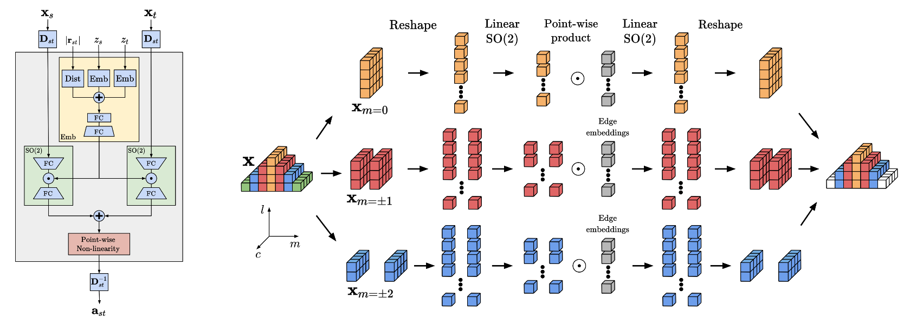

# eSCN

Reducing SO(3) Convolutions to SO(2) for Efficient Equivariant GNNs

+ useful links:
  + eSCN [paper](https://arxiv.org/abs/2302.03655)
  + eSCN [code](https://github.com/Open-Catalyst-Project/ocp/tree/main/ocpmodels/models/escn)
  + SCN [paper](https://proceedings.neurips.cc/paper_files/paper/2022/hash/3501bea1ac61fedbaaff2f88e5fa9447-Abstract-Conference.html)

## 摘要

当前的图神经网络遵循SO3不变性设计，但是等变卷积作为其中的基础操作，其计算复杂度随着张量阶数的增加而急剧增长。本文通过将SO3卷积降为SO2卷积来缓解这个问题。具体来说，先将node embedding的主轴与edge vector对齐，这个操作使得后续的卷积操作变得稀疏，并能够将计算复杂度从$O(L^6)$降为$O(L^3)$,其中L为球谐函数$Y_{l,m}(\vec{r})$的指标$l$的最大值。

## 1. 介绍

在很多领域，机器学习模型需要遵循等变性的约束。这些等变性包括平移或者旋转，即当我们对输入数据进行了等变操作，那么模型的输出也应该进行同等的操作。比如在目标检测和3D点云中的平移和旋转操作，应该满足这种等变性。这种等变性可以提供强大的先验知识，可以提高数据效率，改善泛化能力，并消除对数据增强的需求。SO3等变图神经网络在处理几何信息问题（比如3D点云和原子体系）中展现出了非常大的潜力。这些模型利用不可约表示的几何张量作为节点嵌入，并利用了节点间的方向信息。这种网络的构造模块中最基本的操作就是基于不可约表示的等变卷积，也就是张量积。但是张量积操作的计算复杂度与不可约表示的阶数L关系为$O(L^6)$，这限制了实际中的张量积中L最大取2或者3。

本文通过提出一个高效的方法来完成等变卷积。其中一个关键在于计算等变卷积的时候，如果节点的embedding的主轴与edge的方向一致，那么节点的不可约表示表现出一些特殊的性质。具体就是等变卷积的计算将变得稀疏，导致计算复杂度从$O(L^6)$降为$O(L^3)$，并移除了CG（Clebsch-Gordan）系数的计算过程。这使得模型可以采用更高阶的不可约表示。

此外，本文还揭示了这个方法与SO2卷积的关系。实际上在考虑SO3等变任务中预测每个原子的受力时，信息传播的过程降维到了SO2操作。因为当node embedding的不可约表示主轴与edge方向对齐后，就只剩下一个旋转的自由度。总的来说，当node embedding的不可约表示经过适当的旋转，SO3的张量积可以化简为一组基于SO2的卷积，从而可以显著降低计算量。

基于上面的方案，本文实现了一种高效利用GPU做等变卷积的等变GNN - eSCN (Equivariant Shherical Channel Network)。在OC20和OC22大型DFT数据集上，eSCN取得了SOTA的表现，特别是在原子受力和弛豫结构预测上面取得了显著的性能提升。

## 2. 相关工作

在机器学习模型中考虑数据的对称性可以提升数据的效率和模型的泛化能力。群论是一种刻画对称性的数学工具。群G包含一个集合以及在这个集合元素上的操作，满足以下四个主要条件：

+ 封闭性：对于群中的任意两个元素，它们的运算结果仍然在该集合中。换句话说，群的运算不会使元素离开该集合。
+ 结合性：群的二元运算是结合的，也就是说，对于群中的任意三个元素 a、b 和 c，(a * b) * c = a * (b * c)，其中 * 表示群的二元运算。
+ 单位元素：群中存在一个特定的元素（通常用 e 表示），称为单位元素，满足对于任意群中的元素 a，e * a = a * e = a。单位元素是群中的"恒等元素"，使用它与其他元素进行运算不会改变这些元素的值。
+ 逆元素：对于群中的每个元素 a，存在一个逆元素，通常用 a^-1 表示，使得 a * a^-1 = a^-1 * a = e，其中 e 是群的单位元素。逆元素用于撤销给定元素的作用，使得群中的每个元素都具有可逆性。

如果一个集合和其上的二元运算满足以上四个条件，那么这个结构被称为一个群。

群元素$G$作用到矢量空间$V$表示为:$*:G\times V \rightarrow V$，即群操作作用到矢量空间V中的任一矢量，得到新的矢量任然属于原来的矢量空间V。对于操作$F：V \rightarrow W$:

+ G-**Invariant** :$if \forall v \in V, g\in G  \quad\quad\quad  F(g*v)=F(v)$
+ G-**Equivariant** :$if \forall v \in V, g \in G \quad\quad  F(g*v)=g*F(v)$

对于本文，我们只对于SO(3)群感兴趣，即三维的空间旋转群。实际上，3D旋转群与描述量子作用的物理定律有着非常密切的联系。当我们旋转一个原子分子系统，系统的能量不应该发生变化，即SO(3)不变性，而原子的受力则应该发生相应的旋转，即SO(3)等变性。三维空间里面等变性是显而易见的，但是使用原子embedding的等变模型所在的空间则在非常高的维度中。在等变模型中，不可约表示对应实球谐函数的系数。给定系数$\bold{x}$, 定义一个球函数$F_{\bold{x}}: S^2 \rightarrow \mathbb{R}$:

$$
F_{\bold{x}}(\hat{\bold{r}}) = \sum_{l,m} \bold{x}_m^{(l)} \bold{Y}_m^{(l)}(\hat{\bold{r}})  \tag{1}
$$

其中，$\hat{r} = \bold{r} / |\bold{r}|$是单位矢量，表示方向， $\bold{Y}_m^{(l)}$ 是实球谐基函数，其中$l\in [0, L], m\in [-l, l]$。球谐函数有一个特殊的性质：对于3D旋转$\bold{R}$, 存在一个维度为$(2l+1)\times(2l+1)$的Wigner D-matrix $D^{(l)}(\bold{R})$满足下面关系:

$$
\bold{x}^{(l)} \cdot  \bold{Y}^{(l)} (\bold{R} \cdot \hat{\bold{r}}) = (\bold{D}^{(l)}(\bold{R}\bold{x}^{(l)})) \cdot \bold{Y}^{(l)}(\hat{\bold{r}})   \tag{2}
$$

这是将SO(3)群操作作用到球谐系数上面的基本性质：

$$
\bold{R} * \bold{x}^{(l)} = \bold{D}^{(l)}(\bold{R}) \cdot \bold{x}^{(l)}   \tag{3}
$$

### 机器学习势

传统上，采用机器学习方法预测分子的能量和受力依赖手工特征表示，比如MMFF94，sGDML。最近构造机器学习势转移到基于图神经网络的端到端模型。早期关于GNN的工作专注于从原子的坐标中提取标量表示。这种方法通过利用这种不变的特征来满足模型的旋转不变性。比如CGNN和SchNet采用了原子间距离信息，DimeNet，SphereNet和GemNet则扩展了这些不变的标量特征，他们还计算了三个原子的夹角和4个原子的二面角。

最近，等变模型在小的分子数据集上（比如MD17，QM9）超越了这些不变GNN网络。这些模型基于由Cohen和Welling引入的可操纵性和等变性概念，它们基于几何张量作为node embedding，并且通过对网络层的约束确保整个网络对于SO(3)操作是等变的。其中的关键的操作就是计算原子embedding与edge的方向向量的张量积。这类网络模型有TFN（Tensor Field Network)，NequIP, SEGNN, MACE, Allegro和Equiformer。最近，SCN在OC20数据集上也超越了所有的不变GNN网络。它用几何张量来表示原子的embedding，但是并不是严格的等变网络，而且也没有计算任何的张量积。

### e3nn 网络

在e3nn网络中，原子的embedding通过球谐系数$(\bold{x}_{ic})_m^{(l)}$来编码，其中$0\leq l\leq L, -l \leq m \leq l$, $1\leq c \leq C_l$则是通道数。假定不同的$l$的通道数是相同的$C$,那么一个原子的embedding维度为$(L+1)^2 \times C$. 这些embedding又被称为不可约表示，因为他们的旋转依赖Wigner D-matrices，而Wigner D-matrices是SO(3)的不可约表示。

合理的使用不可约表示可以使得网络操作是SO(3)等变的。GNN网络中的一个关键部分是信息传递，而信息传递的基本模块是等变卷积的结果$\bold{a}_{st}$。对所有的这些$\bold{a}_{st}$进行求和，得到更新的节点embedding：

$$
\bold{x}_t^{\prime} = \frac{1}{|N_t|} \sum_{s\in N_t} \bold{a}_{st}   \tag{4}
$$

其中，等变卷积是通过计算输入embedding$\bold{x}_t$和edge方向$\hat{\bold{r}}$的张量积得到的。计算方式如下：

$$
\bold{a}_{st}^{(l_o)} = \sum_{l_i, l_f} \bold{x}_s^{(l_i)} \otimes _{l_i, l_f}^{l_o} \bold{h}_{l_i, l_f, l_o} \bold{Y}^{(l_f)} (\hat{\bold{r}}_{st})   \tag{5}
$$

上式中，$h_{l_i, l_f, l_o} := \bold{F}_{l_i, l_f, l_o} (|\bold{r}_{st}, z_s, z_t) $是一个可学习的非线性函数（后面我们就知道，这个就是edge embedding模块的功能），其输入为原子之间的距离，原子s和t的原子序数，输出为一个标量系数。其中$l_i, l_f, l_o$分别表示输入节点embedding，edge embedding和输出节点embedding的$l$。

对于张量积$\otimes_{l_i, l_f}^{l_o}$，可以通过CG系数(Clebsch-Gordan coefficients)展开来计算：

$$
\begin{array}{c}\left(\mathbf{x}_{s}^{\left(l_{i}\right)} \otimes_{l_{i}, l_{f}}^{l_{o}} \mathbf{h}_{l_{i}, l_{f}, l_{o}} \mathbf{Y}^{\left(l_{f}\right)}\left(\hat{\mathbf{r}}_{s t}\right)\right)_{m_{o}}^{\left(l_{o}\right)}=  \sum_{m_{i}, m_{f}}\left(\mathbf{x}_{s}^{\left(l_{i}\right)}\right)_{m_{i}} \mathbf{C}_{\left(l_{i}, m_{i}\right),\left(l_{f}, m_{f}\right)}^{\left(l_{o}, m_{o}\right)} \mathbf{h}_{l_{i}, l_{f}, l_{o}} \mathbf{Y}_{m_{f}}^{\left(l_{f}\right)}\left(\hat{\mathbf{r}}_{s t}\right)\end{array}  \tag{6}
$$

其中CG系数相当于是物理上由量子数${l, m}$表征的两个基矢的内积(参考[wiki](https://en.wikipedia.org/wiki/Clebsch%E2%80%93Gordan_coefficients))：

$$
\mathbf{C}_{(l_i, m_i),(l_f, m_f)}^{(l_o, m_o)} = \langle {l_i m_i l_f m_f} \mid {l_o, m_o} \rangle
$$

## 3. 高效的等变卷积

完整的张量积的计算复杂度使得使用更高阶的$L \ge 2$非常昂贵。但是对于很多的应用，比如对原子系统进行建模，高保真度的角度信息对于模拟它们之间的相互作用至关重要，因此需要保留更高阶的$L$。本文下面将展示如何加速这些计算。

假定$F$是一个SO(3)等变函数，那么对于Wigner-D 旋转矩阵$\bold{D}^{(l)}$、旋转矩阵$\bold{R}$和$\bold{x}^{(l)}$，以下关系式成立：

$$
F(\bold{x}^{(l)}) = \bold{D}^{(l)}(\bold{R}^{-1}) \cdot F(\bold{D}^{(l)}(\bold{R}) \cdot \bold{x}^{(l)})   \tag{7}
$$

结合公式(2),(5)和(7)，得到：

$$
\bold{a}_{st}^{(l_o)} = \bold{D}^{-1} \cdot \sum _{l_i, l_f} \widetilde{\bold{x}}_s^{(l_i)} \otimes _{l_i, l_f} ^ {l_o} \bold{h}_{l_i, l_f, l_o} \bold{Y}^{(l_f)} (\bold{R} \cdot \hat{\bold{r}}_{st})   \tag{8}
$$

其中，$\widetilde{\bold{x}}_s^{l_i} = \bold{D}^{l_i} (\bold{R}) \cdot \bold{x}_s^{l_i} $，$ \bold{D}^{-1} = \bold{D}^{l_o} (\bold{R}^{-1})$。公式(8)中$\bold{a}_{st}^{(l_o)}$实际上相当于公式(7)中的$F$函数，其转换过程就是先对$\bold{a}_{st}^{(l_o)}$做一次$\bold{R}$旋转，然后再对其做一次逆旋转$\bold{R}^{-1}$，最终保持$\bold{a}_{st}^{(l_o)}$不变。

接下来便是重点，通过选择一个特殊的旋转$\bold{R}$，我们可以降低公式(8)的计算量。特别是当我们选择旋转矩阵$\bold{R}_{st}$使得$\bold{R}_{st} \cdot \hat{\bold{r}}_{st} = (0, 1, 0)$，那么$\bold{Y}(\bold{R}_{st} \cdot \hat{\bold{r}_{st}})$将变得稀疏：

$$
\bold{Y}_m^{(l)} (\bold{R}_{st} \cdot \hat{\bold{r}}_{st}) \propto \delta_m^{(l)} = \left\{
\begin{array}{l}
    1  \quad if m=0 \\
    0  \quad if m\ne 0
\end{array}
\right.                 \tag{9}
$$

这种做法在计算电磁学中被广泛使用，特别是在快速多极法中，这被称为用于计算平移算子的"点射法"。

回头来看，公式(7)的作用就显现出来了。通过对$\bold{a}_{st}^{(l_o)}$做一次旋转，可以使得$\bold{Y}(\bold{R}_{st} \cdot \hat{\bold{r}_{st}})$变得稀疏，用于化简求和部分的运算。之后，再旋转回来，保证了$\bold{a}_{st}^{l_o}$的结果是不变的。

将公式(9)代入公式(8),化简$\bold{a}_{st}^{(l_o)}$得到：

$$
\bold{a}_{st}^{(l_o)} = \bold{D}_{st}^{-1} \cdot \sum _{l_i, l_f} \widetilde{\bold{x}}_s^{l_i} \otimes _{l_i, l_f} ^ {l_o} \bold{h}_{l_i, l_f, l_o} \delta^{l_f}   \tag{10}
$$

这里大大的简化了张量积的计算量，因为不需要对$m_f$进行求和了。公式(10)中的张量积部分采用CG系数重写为：

$$
\begin{array}{c}\left(\tilde{\mathbf{x}}_{s}^{\left(l_{i}\right)} \otimes_{l_{i}, l_{f}}^{l_{o}} \mathbf{h}_{l_{i}, l_{f}, l_{o}} \delta^{\left(l_{f}\right)}\right)_{m_{o}}^{\left(l_{o}\right)}=  \sum_{m_{i}}\left(\tilde{\mathbf{x}}_{s}^{\left(l_{i}\right)}\right)_{m_{i}} \mathbf{C}_{\left(l_{i}, m_{i}\right),\left(l_{f}, 0\right)}^{\left(l_{o}, m_{o}\right)} \mathbf{h}_{l_{i}, l_{f}, l_{o}}\end{array}  \tag{11}
$$

进一步可以看到，公式(11)中的CG系数也是稀疏的。

真理： CG系数 $\mathbf{C}_{\left(l_{i}, m_{i}\right),\left(l_{f}, 0\right)}^{\left(l_{o}\right)}$ 非0，当且仅当 $m_{i}= \pm m_{o}$. 具体来看 $\mathbf{C}_{\left(l_{i}, m\right),\left(l_{f}, 0\right)}^{\left(l_{o}, m\right)}=$ $\mathbf{C}_{\left(l_{i},-m\right),\left(l_{f}, 0\right)}^{\left(l_{o},-m\right)}$， $\mathbf{C}_{\left(l_{i},-m\right),\left(l_{f}, 0\right)}^{\left(l_{o}, m\right)}=-\mathbf{C}_{\left(l_{i}, m\right),\left(l_{f}, 0\right)}^{\left(l_{o},-m\right)}$。

综上，CG系数规律可以用下面的关系式来表示:

\[
\left(\mathbf{c}_{l_{i}, l_{f}, l_{o}}\right)_{m}=\left\{\begin{array}{ll}
\mathbf{C}_{\left(l_{i}, m\right),\left(l_{f}, 0\right)}^{\left(l_{o}, m\right)} & \text { if } m>0 \\
\mathbf{C}_{\left(l_{i}, 0\right),\left(l_{f}, 0\right)}^{\left(l_{i}, 0\right)} & \text { if } m=0 \\
\mathbf{C}_{\left(l_{i}, m\right),-,\left(l_{f}, 0\right)}^{\left(l_{o},-m\right)} & \text { if } m<0
\end{array}\right.    \tag{12}
\]

更进一步，公式(10)右边化简为：

$$
\bold{a}_{st}^{(l_o)} = \bold{D}_{st}^{-1} \cdot \sum _ {l_i} \bold{w} _{st, l_i} ^ {(l_o)}   \tag{13}
$$

其中$\bold{w} _{st, l_i} ^ {(l_o)} $的定义如下：

对于$m_o > 0$:

\[
\left(\begin{array}{c}
\left(\mathbf{w}_{s t, l_{i}}^{\left(l_{o}\right)}\right)_{m_{o}} \\
\left(\mathbf{w}_{s t, l_{i}}^{\left(l_{o}\right)}\right)_{-m_{o}}
\end{array}\right)=\left(\begin{array}{cc}
\tilde{\mathbf{h}}_{m_{o}}^{\left(l^{\prime}, l\right)} & -\tilde{\mathbf{h}}_{-m_o}^{\left(l^{\prime}, l\right)} \\
\tilde{\mathbf{h}}_{-m_{o}}^{\left(l^{\prime}, l\right)} & \tilde{\mathbf{h}}_{m_{o}}^{\left(l^{\prime}, l\right)}
\end{array}\right) \cdot\left(\begin{array}{c}
\left(\tilde{\mathbf{x}}_{s}^{\left(l_{i}\right)}\right)_{m_{o}} \\
\left(\tilde{\mathbf{x}}_{s}^{\left(l_{i}\right)}\right)_{-m_{o}}  \tag{13.5}
\end{array}\right)  
\]

对于 $m_{o}=0$ :
\[
\left(\mathbf{w}_{s t, l_{i}}^{\left(l_{o}\right)}\right)_{0}=\tilde{\mathbf{h}}_{0}^{\left(l_{i}, l_{o}\right)}\left(\tilde{\mathbf{x}}_{s}^{\left(l_{i}\right)}\right)_{0}  \tag{14}
\]

$\tilde{\mathbf{h}}^{\left(l_{i}, l_{o}\right)}$ 定义如下:
\[
\tilde{\mathbf{h}}_{m}^{\left(l_{i}, l_{o}\right)}=\sum_{l_{f}}\left(\mathbf{h}_{l_{i}, l_{f}, l_{o}}\left(\mathbf{c}_{l_{i}, l_{f}, l_{o}}\right)_{m}\right)   \tag{15}
\]

系数$\tilde{\mathbf{h}}^{\left(l_{i}, l_{o}\right)}$ 与$\bold{h}_{l_i, l_f, l_o}$是线性双射关系，因此可以直接对$\tilde{\mathbf{h}}^{\left(l_{i}, l_{o}\right)}$进行参数化而不损失或增加任何信息。个人理解，也就是说在编码实现中，如果将$\bold{h}_{l_i, l_f, l_o}$ 当做神经网络中待优化的变量，可以直接用$\tilde{\mathbf{h}}^{\left(l_{i}, l_{o}\right)}$来替代$\bold{h}_{l_i, l_f, l_o}$。

可以看到，在公式(14)中，我们已经不需要计算CG系数，并且也不需要对$m_f, m_i和l_f$进行求和运算了。

## 4. SO(2) formulation

这节主要讲上述的化简过程。主要思想是当SO(3)操作被固定了一个方向后，就降维到了SO(2)。正如上面的推理过程一样。pass

## 5. 架构

给定$n$个原子组成的系统，我们的目标是预测这个系统的能量$E$和每个原子的受力$f_i$。这些物理量是通过一个GNN网络来预测的，其中每个节点代表一个原子，edge代表邻近的两个原子连接。网络的输入为每个原子的坐标$\bold{r}_i$和原子序数$z_i$。每个原子的邻近原子数$N_i$通过一个固定的截断距离来控制，且最大为20。

每个节点$i$的embeding表示为$\bold{x}_{imc}^{(l)}$，其中$l,m$为球谐函数的两个量子数，$c$为通道数。$\bold{x}_i^{(0)}$根据原子序数$z_i$来初始化；当$l\ne 0$, $\bold{x}_i^{(l)}$都设置为0。节点embedding $\bold{x}_i$通过GNN中的消息传递机制来更新。首先计算每个原子周边所有的edge信息$\bold{a}_{st}$，然后聚合到中心原子上。能量和原子受力根据最后一层网络的节点embedding来计算。

节点embedding部分的代码如下：

```python {.line-numbers}
class SO3_Embedding(torch.nn.Module):
    ...
    def __init__(
        self,
        length: int,
        lmax_list: List[int],
        num_channels: int,
        device: torch.device,
        dtype: torch.dtype,
    ) -> None:
        super().__init__()
        self.num_channels = num_channels
        self.device = device
        self.dtype = dtype
        self.num_resolutions = len(lmax_list)

        self.num_coefficients = 0
        for i in range(self.num_resolutions):
            self.num_coefficients = self.num_coefficients + int(
                (lmax_list[i] + 1) ** 2
            )

        embedding = torch.zeros(
            length,
            self.num_coefficients,
            self.num_channels,
            device=self.device,
            dtype=self.dtype,
        )

        self.set_embedding(embedding)
```

可以看到embedding初始化为维度为`[num_atoms, num_coefficients(irreps_so3_dim), num_channels]`初始值维0的张量，分别对应$\bold{x}$的index $i, ml, c$，即原子序号、球谐量子数ml的组合和通道数。可以看到对于一对$ml$，其对应的最大系数个数为$(L+1)^2$。因为它们的取值关系如下：

$$
\begin{align}
l&=0 \quad m=0  \\
l&=1 \quad m=-1, m=0, m=1  \\
l&=2 \quad m=-2, m=-1, m=0, m=1, m=2 \\
...
\end{align}
$$

之后对node embedding进行初始化，即对于l=0,m=0的index设置为随机初始化的embedding：

```python {.line-numbers}
class eSCN(BaseModel):
    ...
    def forward(self, data):
        ...
        # Init per node representations using an atomic number based embedding
        offset = 0
        x = SO3_Embedding(
            num_atoms,
            self.lmax_list,
            self.sphere_channels,
            device,
            self.dtype,
        )  # x: [natoms, irreps_so3_dim, emb_dim]

        offset_res = 0
        offset = 0
        # Initialize the l=0,m=0 coefficients for each resolution
        for i in range(self.num_resolutions):
            x.embedding[:, offset_res, :] = self.sphere_embedding(
                atomic_numbers
            )[:, offset : offset + self.sphere_channels]
            offset = offset + self.sphere_channels
            offset_res = offset_res + int((self.lmax_list[i] + 1) ** 2)
```

第19-21行便是对node embedding中$m=0,l=0$的参数进行初始化，其中`self.sphere_embedding`就是对原子序数的embedding。需要强调的是，根据公式(1)定义，node embedding的值实际上是原子embedding按照球谐函数展开的系数。

eSCN模型的结构基本与SCN相同，但是用等变的方法替换了原来的消息传递操作。消息聚合方式和输出模块也保持与SCN一致。

### 5.1 消息传递

给定目标节点$t$和邻居$s\in N_t$，我们需要在每层网络更新目标节点的embedding $\bold{x}_t$.消息传递架构可以分为3个部分：

+ (1) edge embedding模块用于计算两个原子相连的edge的信息；
+ (2) 一个实现SO(2)卷积的模块；
+ (3) 一个球面上的非线性操作；

<div style="text-align:center;">
  
</div>

上面的左图是消息传递的架构，右图是SO(2)卷积模块的计算分解图($L=3(个人修改，原始为4), C=4, M=2$)。

#### edge embedding模块

edge embedding模块的输入为两个原子$s和t$的距离$|\bold{r}_{st}$和他们的原子序数$z_s和z_t$。原子序数$z_s和z_t$用一个128维的向量来做embedding；距离$|\bold{r}_{st}|$采用高斯函数展开，其中展宽系数为$\sigma=0.04$，范围为$0~12A$，间隔为0.02A，后面紧跟一个线性层。然后直接将他们加在一起，并通过了两个带非线性激活函数的线性层来作为edge的embedding。这部分可以通过代码清楚的看到：

```python {.line-numbers}
class EdgeBlock(torch.nn.Module):
...
    def forward(self, edge_distance, source_element, target_element):
        # Compute distance embedding
        x_dist = self.distance_expansion(edge_distance) # x_dist: [num_edges, num_Gauss]
        x_dist = self.fc1_dist(x_dist) # x_dist: [num_edges, edge_channels]

        # Compute atomic number embeddings
        source_embedding = self.source_embedding(source_element) # [num_edges, emb_dim]
        target_embedding = self.target_embedding(target_element) # [num_edges, emb_dim]

        # Compute invariant edge embedding
        x_edge = self.act(source_embedding + target_embedding + x_dist) # [num_edges, emb_dim]
        x_edge = self.act(self.fc1_edge_attr(x_edge)) # [num_edges, emb_dim]

        return x_edge
```
#### SO(2)模块

这个模块主要计算两个独立的node embedding $\bold{x}_s和\bold{x}_t$的等变卷积。首先将每个节点的embedding旋转到与y轴对齐：旋转的过程是通过Wigner D-matrices $\bold{D}(R_{st})$乘以节点的embedding实现的，其中$\bold{R}_{st} \cdot \hat{\bold{r}}_{st} = (0, 1, 0)$。SO(2)卷积作用在所有的系数上，这些系数满足$M\le L$. 对于每个$m \in M$, 有$L+1-m$个系数，每个系数又有$C$个通道。与其使用一个大的密集线性层来执行广义卷积，我们将系数进行线性投影到一个 H = 256 的隐藏层。隐藏层的值与edge embedding相乘来融合edge的信息，然后线性扩展到原始层的尺寸$(L+1-m) \times C$。SO(2)卷积的实现实际上只计算了两个线性层，用来分别更新$m$和$-m$的系数，参考公式(14)。后面将证明，$M$可以比$L$要小，这样可以在提高模型效率的同时只丢失很小的精度损失。这里面有两个可能原因：一是大的$m$系数更少，对于特定的$m$，系数的个数为$L+1-m$；二是当节点embedding的方向都旋转到跟edge对齐后，更大的$m$编码的更高频率信息与edge是垂直的，这部分信息的作用相对于与edge平行方向的系数作用更小。

下面是SO(2)模块计算相关代码：

```python {.line-numbers}
class MessageBlock(torch.nn.Module):
    ...

    def forward(self, x, atomic_nubmers, edge_distance, edge_index, SO3_edge_rot, mappingReduced):
        ###############################################################
        # Compute messages
        ###############################################################

        # Compute edge scalar features (invariant to rotations)
        # Uses atomic numbers and edge distance as inputs
        x_edge = self.edge_block(  # [num_edges, emb_dim]
            edge_distance,
            atomic_numbers[edge_index[0]],  # Source atom atomic number
            atomic_numbers[edge_index[1]],  # Target atom atomic number
        ) 

        # Copy embeddings for each edge's source and target nodes
        x_source = x.clone() # [natoms, ir_so3_dim, emb_dim]
        x_target = x.clone() # [natoms, ir_so3_dim, emb_dim]
        x_source._expand_edge(edge_index[0, :]) # [num_edges, ir_so3_dim, emb_dim]
        x_target._expand_edge(edge_index[1, :]) # [num_edges, ir_so3_dim, emb_dim]

        # Rotate the irreps to align with the edge. # with project SO3 to SO2 with m cutoff mmax
        x_source._rotate(SO3_edge_rot, self.lmax_list, self.mmax_list) # [num_edges, ir_so2_dim, emb_dim]
        x_target._rotate(SO3_edge_rot, self.lmax_list, self.mmax_list) # [num_edges, ir_so2_dim, emb_dim]

        # Compute messages: 这里相当于E3网络里面做的tensor product操作，只不过现在降到了SO2卷积
        # x_source(inp): [num_edges, ir_so2_dim, emb_dim]
        # x_edge: [num_edge, emb_dim]
        # x_source(out): [num_edges, ir_so2_dim, emb_dim]
        x_source = self.so2_block_source(x_source, x_edge, mappingReduced) # [num_edges, ir_so2_dim, emb_dim]
        x_target = self.so2_block_target(x_target, x_edge, mappingReduced) # [num_edges, ir_so2_dim, emb_dim]
        ...
```

上述代码中，第11-15行是对edge做embedding，得到一个invariant的edge embedding。第18-21行是得到所有edge的source和target原子的node embedding，其维度标注在代码行后面。这里这里的node embedding还是SO3表示的。第268-269行则是将node embedding做了一个旋转，使得node embedding的主轴与y轴对齐，这样将node embedding的SO3表示降维到SO2表示。之后在第275-276行开始对node embedding做高效的SO(2)卷积操作。

具体计算SO2卷积的代码块如下：

```python {.line-numbers}
class SO2Block(torch.nn.Module):
    ...
    def forward(
        self,
        x,  # [num_edges, ir_so2_dim, emb_dim]
        x_edge, # [num_edges, emb_dim]
        mappingReduced,
    ):
        num_edges = len(x_edge)

        # Reshape the spherical harmonics based on m (order)
        x._m_primary(mappingReduced)

        # Compute m=0 coefficients separately since they only have real values (no imaginary)

        # Compute edge scalar features for m=0
        x_edge_0 = self.act(self.fc1_dist0(x_edge)) # [num_edges, hidden_dim]

        x_0 = x.embedding[:, 0 : mappingReduced.m_size[0]].contiguous() # [num_edges, L+1, emb_dim]
        x_0 = x_0.view(num_edges, -1) # [num_edges, (L+1)*emb_dim]

        x_0 = self.fc1_m0(x_0) # [num_edges, hidden_dim]
        x_0 = x_0 * x_edge_0 # [num_edges, hidden_dim]
        x_0 = self.fc2_m0(x_0) # [num_edges, (L+1)*emb_dim]
        x_0 = x_0.view(num_edges, -1, x.num_channels) # [num_edges, L+1, emb_dim]

        # Update the m=0 coefficients
        x.embedding[:, 0 : mappingReduced.m_size[0]] = x_0

        # Compute the values for the m > 0 coefficients
        offset = mappingReduced.m_size[0]
        for m in range(1, max(self.mmax_list) + 1):
            # Get the m order coefficients
            x_m = x.embedding[
                :, offset : offset + 2 * mappingReduced.m_size[m]
            ].contiguous() # [num_edges, 2*(L+1-m), emb_dim]
            x_m = x_m.view(num_edges, 2, -1) # [num_edges, 2, (L+1-m)*emb_dim] 维度2分别表示m和-m的系数
            # Perform SO(2) convolution
            x_m = self.so2_conv[m - 1](x_m, x_edge) # [num_edges, 2, (L+1-m)*emb_dim]
            x_m = x_m.view(num_edges, -1, x.num_channels)
            x.embedding[
                :, offset : offset + 2 * mappingReduced.m_size[m]
            ] = x_m

            offset = offset + 2 * mappingReduced.m_size[m]

        # Reshape the spherical harmonics based on l (degree)
        x._l_primary(mappingReduced) # [num_edges, ir_so2_dim, emb_dim]

        return x
```

第19行是取出node embedding中m=0的feature，22-28行则完成m=0的feature与edge embedding的融合，对应前面公式(14)。后面的第31-45行则是继续计算m>0的情况，对应公式(13)，其中核心的计算在self.so2_conv中，其代码如下：

```python {.line-numbers}
class SO2Conv(torch.nn.Module):
    ...
    def forward(self, x_m, x_edge) -> torch.Tensor:
        # x_m: [num_edges, 2, (L+1-m)*emb_dim]
        # x_edge: [num_edges, emb_dim]
        # Compute edge scalar features
        x_edge = self.act(self.fc1_dist(x_edge)) # [num_edges, 2 * hidden_dim]
        x_edge = x_edge.view(-1, 2, self.hidden_channels) # [num_edge, 2, hidden_dim]

        # Perform the complex weight multiplication
        x_r = self.fc1_r(x_m) # [num_edges, 2, hidden_dim]
        x_r = x_r * x_edge[:, 0:1, :] # [num_edges, 2, hidden_dim]
        x_r = self.fc2_r(x_r) # [num_edges, 2, (L+1-m)*emb_dim]

        x_i = self.fc1_i(x_m) # [num_edges, 2, hidden_dim]
        x_i = x_i * x_edge[:, 1:2, :] # [num_edges, 2, hidden_dim]
        x_i = self.fc2_i(x_i) # [num_edges, 2, (L+1-m)*emb_dim]

        x_m_r = x_r[:, 0] - x_i[:, 1] # [num_edges, (L+1-m)*emb_dim]
        x_m_i = x_r[:, 1] + x_i[:, 0] # [num_edges, (L+1-m)*emb_dim]

        return torch.stack((x_m_r, x_m_i), dim=1).contiguous()  # [num_edges, 2, (L+1-m)*emb_dim]
```

第7-8行目的是将edge embedding改造为对应m和-m的两个embedding，之后分别与node embedding $x_m$中的$m和-m$两部分的feature相乘，参考公式(13.5)。最后再将$m$和$-m$两部分合并起来。

#### 逐点球非线性 (Point-wise spherical non-linearity)

在对两个SO(2)模块的结果进行相加后，对它们进行一个逐点球非线性操作：

$$
\mathbf{x} \rightarrow \int \mathbf{Y}(\hat{\mathbf{r}}) \operatorname{SiLU}\left(F_{\mathbf{x}}(\hat{\mathbf{r}})\right) d \hat{\mathbf{r}}  \tag{21}
$$

这个逐点函数是一个等变操作，因为它在球面上所有的点作用了相同的函数。对于这个操作，我们采用了SiLU激活函数。实际中这个积分操作使用离散的求和实现的。这个得到的信息$\bold{a}_{st}$最终会被Wigner D-matrix$\bold{D}(\bold{R}_{st}^{-1})$旋转回原来的坐标系。这个操作相关代码为：

```python {.line-numbers}
class MessageBlock(torch.nn.Module):
    ...
    def forward(
        self,
        x,
        atomic_numbers,
        edge_distance,
        edge_index,
        SO3_edge_rot,
        mappingReduced,
    ):
    ...

        # Add together the source and target results
        x_target.embedding = x_source.embedding + x_target.embedding # [num_edges, ir_so2_dim, emb_dim]

        # Point-wise spherical non-linearity
        # the transformation of a spherical tensor into a scalar function on the sphere has 
        # physical significance because it allows us to extract rotationally invariant information 
        # about a physical system
        x_target._grid_act(self.SO3_grid, self.act, mappingReduced) # [num_edges, ir_so2_dim, emb_dim]

        # Rotate back the irreps
        x_target._rotate_inv(SO3_edge_rot, mappingReduced) # [num_edges, ir_so3_dim, emb_dim]
    
    ...
```

其中关键操作在第21行，详细代码为：

```python {.line-numbers}
class SO3_Embedding(torch.nn.Module):
    ...
    # Compute point-wise spherical non-linearity
    def _grid_act(self, SO3_grid, act, mappingReduced) -> None:
        offset = 0
        for i in range(self.num_resolutions):
            num_coefficients = mappingReduced.res_size[i] # ir_so2_dim

            x_res = self.embedding[
                :, offset : offset + num_coefficients
            ].contiguous() # [num_edges, ir_so2_dim, emb_dim]
            to_grid_mat = SO3_grid[self.lmax_list[i]][
                self.mmax_list[i]
            ].get_to_grid_mat(self.device) # [14, 5, ir_so2_dim]
            from_grid_mat = SO3_grid[self.lmax_list[i]][
                self.mmax_list[i]
            ].get_from_grid_mat(self.device) # [14, 5, ir_so2_dim]

            x_grid = torch.einsum("bai,zic->zbac", to_grid_mat, x_res) # [num_edges, 14, 5, emb_dim]
            x_grid = act(x_grid) # [num_edges, 14, 5, emb_dim]
            x_res = torch.einsum("bai,zbac->zic", from_grid_mat, x_grid) # [num_edges, ir_so2_dim, emb_dim]

            self.embedding[:, offset : offset + num_coefficients] = x_res
            offset = offset + num_coefficients

```

根据公式(21),这里的关键操作第19行和第21行对应公式中的$F_\bold{x}(\hat{\bold{r}})$和$\bold{Y}(\hat{\bold{r}})$。但是这里`to_grid_mat`和`from_grid_mat`的含义我暂时也不理解，可以确定的是这两个张量是由最初的旋转矩阵$\bold{R}$以及量子数$l$和$m$确定下来的。

经过前面的edge embedding, SO2 convolution和Point-wise spherical non-linearity，整个消息传递模块的输出为$\bold{a}_{st}$，即为一个edge对应的feature。

### 5.2 消息聚合

把所有的消息聚合到一起便得到一个节点的feature，$\bold{a}_t = \sum _s \bold{a}_{st}$。这个实现的代码为：

```python
# Compute the sum of the incoming neighboring messages for each target node
x_target._reduce_edge(edge_index[1], len(x.embedding)) # [natoms, ir_so3_dim, emb_dim]
```

正如SCN中那样，后面接着对$\bold{x}_t$和$\bold{a}_t$施加另一个非线性函数，这样可以得到更负责的消息的非线性作用。这个结果再加上原始的$\bold{x}_t$用来更新原始的$\bold{x}_t$:

$$
\mathbf{x}_{t}^{\prime}=\mathbf{x}_{t}+\int \mathbf{Y}(\hat{\mathbf{r}}) P_{a g g}\left(F_{\mathbf{a}_{t}}(\hat{\mathbf{r}}), F_{\mathbf{x}_{t}}(\hat{\mathbf{r}})\right) d \hat{\mathbf{r}}   \tag{22}
$$

对于公式中的函数$P_{agg}$，我们采用的是一个3层的线性层($(\mathbb{R}^{2C} \rightarrow \mathbb{R}^C)$)，采用的SiLU激活函数。

```python {.line-numbers}
class LayerBlock(torch.nn.Module):
    ...
    def forward(
        self,
        x,
        atomic_numbers,
        edge_distance,
        edge_index,
        SO3_edge_rot,
        mappingReduced,
    ):
        # Compute messages by performing message block
        x_message = self.message_block( # [natoms, irreps_so3_dim, emb_dim]
            x, # [natoms, irreps_so3_dim, emb_dim]
            atomic_numbers,
            edge_distance,
            edge_index,
            SO3_edge_rot,
            mappingReduced,
        )

        # Compute point-wise spherical non-linearity on aggregated messages
        max_lmax = max(self.lmax_list)

        # Project to grid
        # Convert from a spherical harmonic representation to a spherical grid representation
        x_grid_message = x_message.to_grid(self.SO3_grid, lmax=max_lmax) # [natoms, 14, 15, emb_dim]
        x_grid = x.to_grid(self.SO3_grid, lmax=max_lmax) # [natoms, 14, 15, emb_dim]
        x_grid = torch.cat([x_grid, x_grid_message], dim=3) # [natoms, 14, 15, 2*emb_dim]

        # Perform point-wise convolution
        x_grid = self.act(self.fc1_sphere(x_grid)) # [natoms, 14, 15, emb_dim]
        x_grid = self.act(self.fc2_sphere(x_grid)) # [natoms, 14, 15, emb_dim]
        x_grid = self.fc3_sphere(x_grid) # [natoms, 14, 15, emb_dim]

        # Project back to spherical harmonic coefficients
        x_message._from_grid(x_grid, self.SO3_grid, lmax=max_lmax) # [natoms, irreps_so3_dim, emb_dim]

        # Return aggregated messages
        return x_message
```

通过对比公式(22)，可以看到上述代码第27-29行对应计算$F_{\bold{a}_t}(\hat{\bold{r}})$和$F_{\bold{x}_t}(\hat{\bold{r}})$。且通过对比`to_grid`与`get_to_grid_mat`的实现关系，可以发现公式(22)中的函数$F(\hat{\bold{r}})和\bold{Y}(\hat{\bold{r}})$与公式(21)中的$F(\hat{\bold{r}})和\bold{Y}(\hat{\bold{r}})$是一样的函数。第32-34行则对应$P_{agg}$函数，是三个线性层的叠加。注意，`LayerBlock`返回的是公式(22)的右边第二项。

### 5.3 输出模块

最终，整个原子系统的能量和每个原子的受力根据每个节点的embedding来计算，采用跟SCN一样的方法。对于能量，对所有的node embedding求和：

$$
E = \sum _i \int P_{energy}(F_{\bold{x}_i}(\hat{\bold{r}}))d\hat{\bold{r}}   \tag{23}
$$

其中$P_{energy}$是一个3层神经网络（$\mathbb{R}^C \rightarrow \mathbb{R}$）

对于受力，采用类似的方式但是添加了一个$\hat{\bold{r}}$作为权重：

$$
\bold{f}_i = \int \hat{\bold{r}} P_{force} (F_{\bold{x}_i}(\hat{\bold{r}}))d\hat{\bold{r}}  \tag{24}
$$

这里$P_{force}$也是一个3层神经网络（$\mathbb{R}^C \rightarrow \mathbb{R}$）。对于公式(23)和(24)，我们使用加权球面Fibonacci点集对积分进行离散近似，在球面上采样了128个点。相关代码如下：

```python {.line-numbers}
# Compute the embedding values at every sampled point on the sphere
class eSCN(BaseModel):

    def __init__(...):
        ...
        # For each spherical point, compute the spherical harmonic coefficient weights
        sphharm_weights: List[nn.Parameter] = []
        for i in range(self.num_resolutions):
            sphharm_weights.append(
                nn.Parameter(
                    o3.spherical_harmonics(
                        torch.arange(0, self.lmax_list[i] + 1).tolist(),
                        self.sphere_points,
                        False,
                    ),
                    requires_grad=False,
                )
            )
        self.sphharm_weights = nn.ParameterList(sphharm_weights)
        ...
    
    def forward(self, data):
        ...
        for i in range(self.num_resolutions):
            num_coefficients = int((x.lmax_list[i] + 1) ** 2)
            x_pt = torch.cat( # [natoms, num_sphere_samples, emb_dim]
                [
                    x_pt,
                    torch.einsum(
                        "abc, pb->apc",
                        x.embedding[:, offset : offset + num_coefficients], # [natoms, irreps_so3_dim, emb_dim]
                        self.sphharm_weights[i], # [num_sphere_samples, irreps_so3_dim]
                    ).contiguous(),
                ],
                dim=2,
            )
            offset = offset + num_coefficients
    ...
```

其中`self.sphharm_weights`是通过特殊方法(球面Fibonacci点集)产生的权重，相当于对于node embedding中的`irreps_so3_dim`维度都赋予一个权重。这个就是公式(23)和(24)中的函数$F_{\bold{x}_i}(\hat{\bold{r}})$。下面也分给给出能量的输出模块：

```python {.line-numbers}
class EnergyBlock(torch.nn.Module):
    """
    Energy Block: Output block computing the energy

    Args:
        num_channels (int):         Number of channels
        num_sphere_samples (int):   Number of samples used to approximate the integral on the sphere
        act (function):             Non-linear activation function
    """

    def __init__(
        self,
        num_channels: int,
        num_sphere_samples: int,
        act,
    ) -> None:
        super(EnergyBlock, self).__init__()
        self.num_channels = num_channels
        self.num_sphere_samples = num_sphere_samples
        self.act = act

        self.fc1 = nn.Linear(self.num_channels, self.num_channels)
        self.fc2 = nn.Linear(self.num_channels, self.num_channels)
        self.fc3 = nn.Linear(self.num_channels, 1, bias=True)

    def forward(self, x_pt) -> torch.Tensor:
        # x_pt are the values of the channels sampled at different points on the sphere
        x_pt = self.act(self.fc1(x_pt)) # [natoms * num_sphere_samples, emb_dim]
        x_pt = self.act(self.fc2(x_pt)) # [natoms * num_sphere_samples, emb_dim]
        x_pt = self.fc3(x_pt) # [natoms * num_sphere_samples, 1]
        x_pt = x_pt.view(-1, self.num_sphere_samples, 1) # [natoms, num_sphere_samples, 1]
        node_energy = torch.sum(x_pt, dim=1) / self.num_sphere_samples # [natoms, 1]

        return node_energy
```

和原子受力的输出模块：

```python {.line-numbers}
class ForceBlock(torch.nn.Module):
    """
    Force Block: Output block computing the per atom forces

    Args:
        num_channels (int):         Number of channels
        num_sphere_samples (int):   Number of samples used to approximate the integral on the sphere
        act (function):             Non-linear activation function
    """

    def __init__(
        self,
        num_channels: int,
        num_sphere_samples: int,
        act,
    ) -> None:
        super(ForceBlock, self).__init__()
        self.num_channels = num_channels
        self.num_sphere_samples = num_sphere_samples
        self.act = act

        self.fc1 = nn.Linear(self.num_channels, self.num_channels)
        self.fc2 = nn.Linear(self.num_channels, self.num_channels)
        self.fc3 = nn.Linear(self.num_channels, 1, bias=False)

    def forward(self, x_pt, sphere_points) -> torch.Tensor:
        # x_pt are the values of the channels sampled at different points on the sphere
        x_pt = self.act(self.fc1(x_pt)) # [natoms * num_sphere_samples, emb_dim]
        x_pt = self.act(self.fc2(x_pt)) # [natoms * num_sphere_samples, emb_dim]
        x_pt = self.fc3(x_pt) # [natoms * num_sphere_samples, 1]
        x_pt = x_pt.view(-1, self.num_sphere_samples, 1) # [natoms, num_sphere_samples, 1]
        forces = x_pt * sphere_points.view(1, self.num_sphere_samples, 3) # [natoms, num_sphere_samples, 3]
        forces = torch.sum(forces, dim=1) / self.num_sphere_samples

        return forces
```

这两个模块比较普通，唯一需要注意的是公式(23)中受力输出模块的方向矢量权重$\hat{\bold{r}}$,也就是上述代码中的`sphere_points`，其定义为：

```python
        # Create a roughly evenly distributed point sampling of the sphere for the output blocks
        self.sphere_points = nn.Parameter(
            CalcSpherePoints(self.num_sphere_samples), requires_grad=False
        )
```

且其维度为`[num_sphere_samples, 3]`。因此可以猜测其为一个单位球面上的均匀分布的点。

至此，整个模型的结构和相关代码分析完毕。
